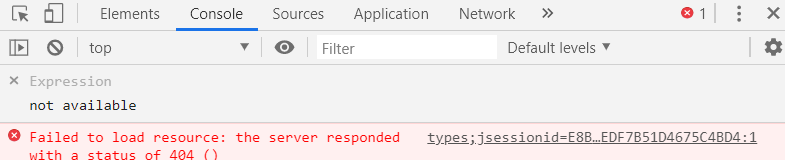
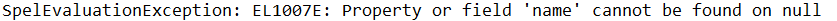
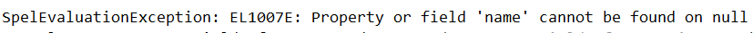

# 2.3

    1.拦截器-》 拦截错误
    2.快捷键：
        ctrl+ 右键 -》 注射室
        ctrl + shift + 右键  -》 关闭右边所有
## 问题

# 2.8 

    1.自动建表：JPA？？？
        注解建表？？？
    2.拦截器、Filter、统一返回结果、
## 问题
1.

# 2.9

    1.th:unless="${#strings.isEmpty(message)}
    2.@Configration
## Thymeleaf 的使用 和错误

    错误:
 
    
    
    1.遍历
        <tr th:each="type,iterStat : ${page.content}">
            <td th:text="${iterStat.count}">1</td>
            <td th:text="${type.name}">刻意练习清单</td>
            <td>
              <a href="#" th:href="@{/admin/types/{id}/input(id=${type.id})}" class="ui mini teal basic button">编辑</a>
              <a href="#" th:href="@{/admin/types/{id}/delete(id=${type.id})}" class="ui mini red basic button">删除</a>
            </td>
          </tr>
    2.<a th:href="@{/admin/types(page=${page.number}+1)}" class=" item" th:unless="${page.last}">下一页</a>

## 拦截器 总结

    1.HandlerInterceptorAdapter
        WebMvcConfigurer
    2.Filter
## 问题
1._fragments.html 是什么

2.@Service什么时候写

3.为什么又登录不上？？？

    JPA失效？？？
        1.数据库没连接上
        2.JPA失效 ——》导入没问题 ——》 页面传输没问题、MDUtils 没问题——》 数据库？？
            ——》 application.properties??? ——》 怎么验证？？？
    数据新建一条语句就可以通过？？？
        1.跟数据库其他字段有关？？？
            创建时间？？？
    其他字段可能受前端影响，比如：？
        1.
        2.在哪里
4.
    
    把 controller 中的model 注释掉 ——》

    前端页面 没有model返回前端页面 ——》 model不能注释 ,model 不能为空
    Thymeleaf 在加载时 有什么是会引起 错误的 怎么查错 ——》 F12没有
        1,因为数据库？？？
        2.index.html 和 _fragments.html 的链接区别
            × index.html 没有模板 ——》 此types 就是彼types
            访问的 login

    没有一个Controller能接收 采用方法2

    有没有可能在解决这类问题时直接跳过
        1.减：注释前端还没有的Thymeleaf
        2.加：补全前端和后端Controller
5.Template[admin/login] 找不到

    其实是 Session的问题 关闭项目 删除缓存即可？？？ (因为login.html和index.html 不可能存在错误)
    
# 2.10

    1.Session 和 Cookie 的区别
        
    2.request.getSession.setAttribute() 、Reuqest.setAttribute() 和 Model.add() 的区别 
        1.
        2.
## template[admin/index] 问题
## 问题
1.

    没有id ——》 th:action="*{id}==null 错误 ——》 * 不存在， th:object="${type}" ，object 不存在
    ——》 拿不到值 ，——》没有 给Model放值 

2.

    name不存在——》但，其它项目有 ——》 type.name 的问题 ，
    哪个层的问题？ type.name改成哪个测试一下 : type.id 、type.name 失败  但，type成功：
    Controller ： ——》 Service ：——》 Repository ：级联的问题？？？ ——》 po   

# 2.11

    1.th:text="${page.totalElements}
    2.<!--/*--> Thymeleaf专有注释
## 问题
1.

    type 能找到 type.name 找不到？ ——》 级联问题 ： blogs 中的type 找不到 ——》数据库底层没有外键
    ——》 在页面创建blogs 时没有 选择Type 而不报错 ，导致没有外键 

2.

    
